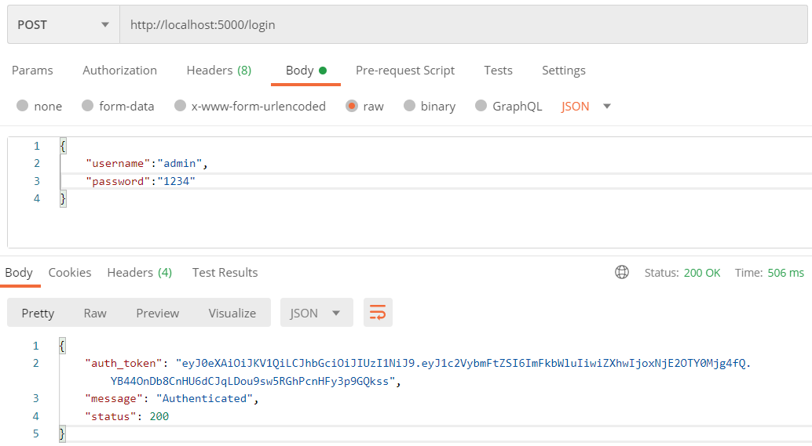
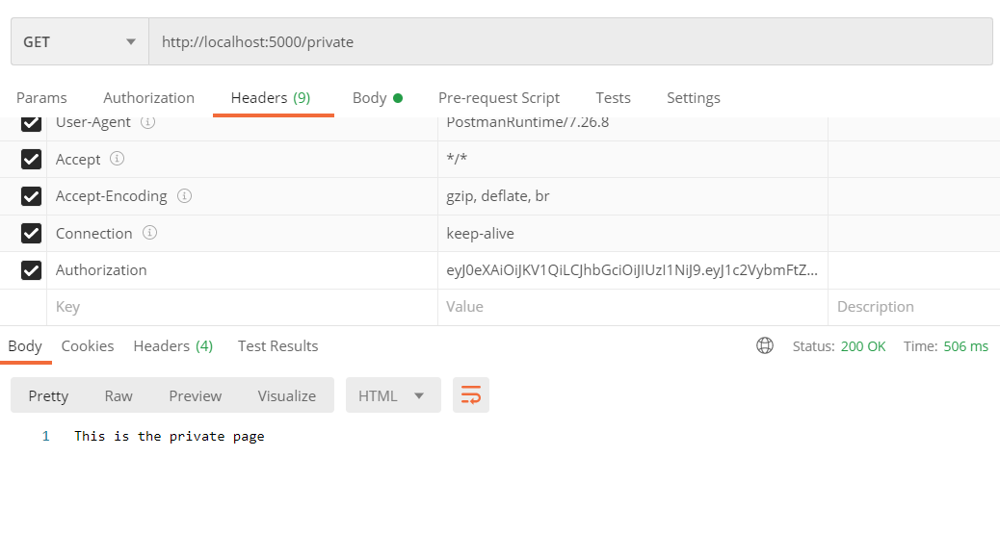

## How to Run

First, you have to install requirements
```
pip install -r requirements.txt
```

Then, run the code
```
python3 app.py
```

### How to make auth request?


### How to see private pages?
